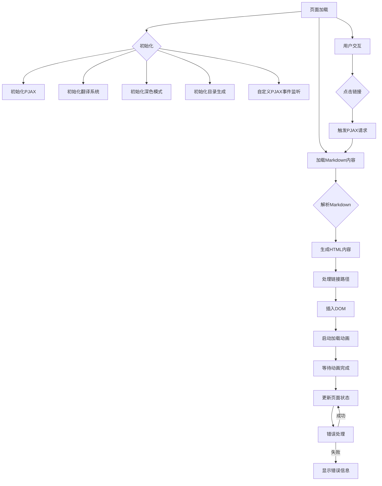
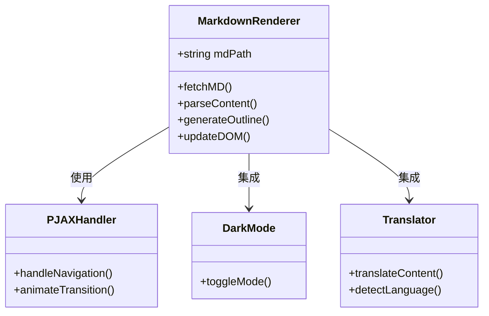

# 流程图

## 核心流程说明

1. **初始化阶段**：加载所有依赖库并配置核心功能模块
2. **内容加载**：通过fetch获取Markdown文件内容并解析
3. **渲染流程**：生成HTML内容 -> 处理路径 -> 更新DOM -> 动画过渡
4. **交互处理**：通过PJAX实现无刷新导航，触发新的加载流程
5. **异常处理**：在关键节点捕获错误并显示友好提示
6. **增强功能**：翻译系统与暗黑模式通过事件总线集成
